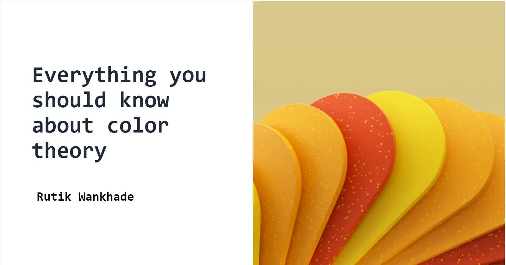
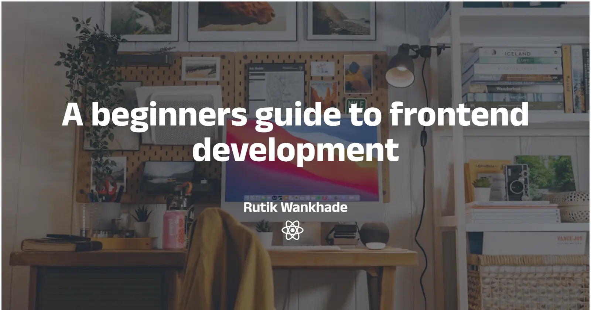

<div align="center">

# Coverlab

Create standout blog cover images in seconds.

[](https://react.dev)
[](https://tailwindcss.com)
[](https://unsplash.com/developers)
[](#)


</div>

## Highlights

- Unsplash search built in (no tab‑switching)
- 7+ designer themes with live preview
- One‑click export (PNG) at perfect blog sizes
- Custom brand icon upload, fonts, and colors
- Clean, responsive, recruiter‑friendly UI

## Demo (Screens)

<details>
<summary>Home</summary>



</details>

<details>
<summary>Editor</summary>



</details>

## Quickstart

```bash
git clone https://github.com/Rambabu-Akkapolu/Coverlab.git
cd Coverlab
npm install
echo REACT_APP_API_ACCESS_KEY=your_unsplash_api_key_here > .env
npm start
```

## Tech

- React + React Router
- Tailwind CSS
- Unsplash JS SDK
- dom-to-image

## About

Built by Rambabu Akkapolu

- Email: rambabuakkapolu970@gmail.com  
- LinkedIn: https://www.linkedin.com/in/rambabu-akkapolu/  
- X/Twitter: https://x.com/A_Rambabu_  
- GitHub: https://github.com/Rambabu-Akkapolu

---

Made with ❤️ using React and Tailwind CSS