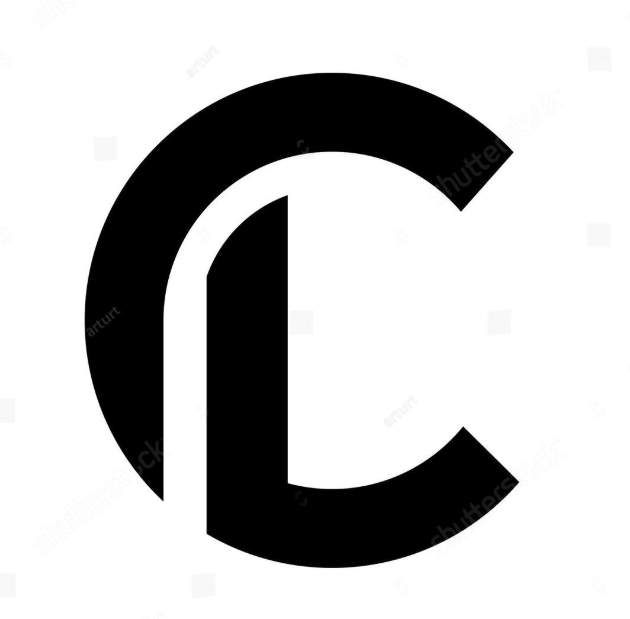
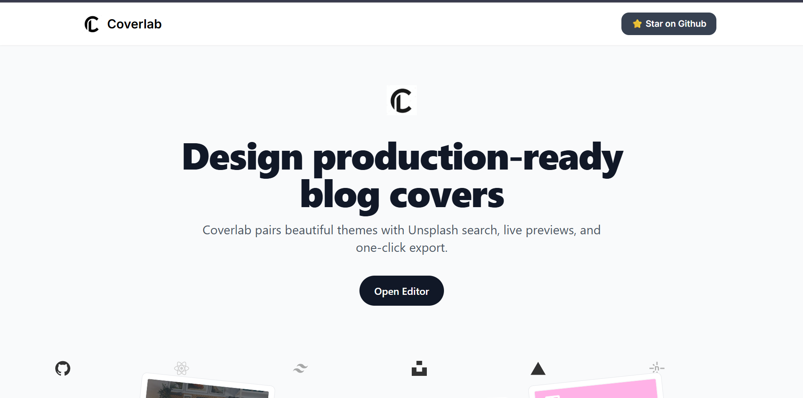
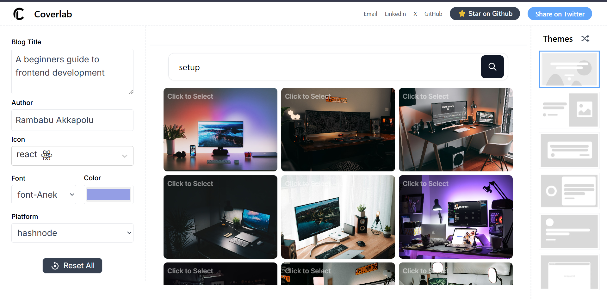

<div align="center">

# Coverlab

Generate professional blog cover images in seconds — consistent, on‑brand, and production‑ready.

<p>
  <a href="https://react.dev"></a>
  <a href="https://tailwindcss.com"></a>
  <a href="https://unsplash.com/developers"></a>
  
  
</p>



</div>

## Overview

Coverlab streamlines cover creation for blogs. Curated themes, integrated image search, and one‑click export help you produce consistent visuals without opening a design tool.

## Capabilities

- Integrated Unsplash search (no tab‑switching)
- 7+ designer themes with live preview
- One‑click PNG export (accurate blog sizes)
- Brand controls: icon, colors, typography
- Responsive, keyboard‑friendly UI

## Core Features

| Area | Details |
|------|---------|
| Images | Unsplash search with attribution and download tracking |
| Themes | Live preview, randomize option, curated presets |
| Canvas | Hashnode/Dev.to sizing presets |
| Export | DOM‑to‑image client export, crisp PNG |
| UX | Keyboard‑friendly inputs, responsive layout |

## UI Preview

### Homepage



### Editor



## Getting Started

Prerequisites
- Node.js 16+ (Create React App compatible)

Install and run
```bash
git clone https://github.com/Rambabu-Akkapolu/Coverlab.git
cd Coverlab
npm install
echo REACT_APP_API_ACCESS_KEY=your_unsplash_api_key_here > .env
npm start
```

## Configuration

Create a `.env` file at the project root:

```env
REACT_APP_API_ACCESS_KEY=your_unsplash_api_key_here
```

Get an access key from Unsplash Developers, then restart the dev server.

## Planned Enhancements

- Drag‑to‑reposition for image and title (finer control)
- JPEG export, quality selector, and custom canvas sizes
- Shareable template links (encode editor state in URL)

— Built with React and Tailwind CSS